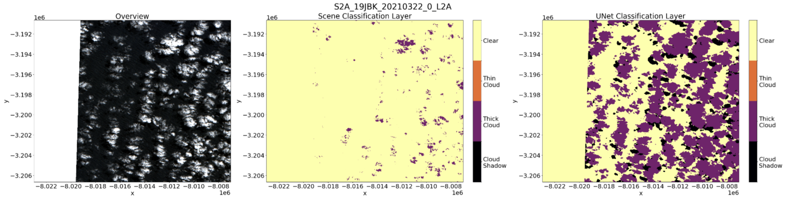

## Technique Overview
- Python
    - PyTorch (semantic segmentation)
    - datacube
    - stackstac
    - matplotlib
    - mkdocs
    - cookiecutter
    - Streamlit
- Data Engineering
- Cloud Computing
    - AWS (EC2, S3)

## Summary

The Clean Sat project utilizes a state-of-the-art cloud masking model to address the challenges of cloud cover and shadows in satellite imagery, enhancing the accuracy of geological and mineral deposit exploration at Rio Tinto Exploration (RTX). Rio Tinto currently uses a processed version of Sentinel-2 satellite images (L2A) and leverages a cloud mask model developed by the European Space Agency (Sen2Cor), which is not satisfactory in detecting cloud and shadow boundaries. The main data science method underlying our approach is semantic image segmentation, as our goal is to assign a class label (cloud, no-cloud, etc) to each pixel in an input Sentinel-2 image. This project evaluates a pre-trained cloud masking algorithm which was based on UNet architecture with a MobileNetV2 encoder. Based on benchmarking tests and evaluation results, a Python package was developed to seamlessly integrate the UNet model into RTX's current pipeline. The package also permits domain experts to review the masking outputs and compare them with the original approach for further validation, which serves as a means of verifying model performance in deployment.

## Visualization

It is necessary to implement a method of verification for new and unlabelled images, to ensure that our model is operating as expected in deployment. As part of our package, we have added functions to aid in the visual confirmation of mask quality. The intention is to integrate domain expertise into the product, such that a geoscientist or trained reviewer can assess the generated masks prior to their compression into the final unclouded output. To this extent, the partner can ensure that there are a limited number of artifacts
still present after masking.

*Example output for an L2A scene using tidysat’s visualization functions. The left panel shows the overview (RGB) band, the middle panel is the Scene Classification Layer (SCL) with only cloud classes included as output by Sen2Cor, and the right panel highlights the UNet Classification Layer (UCL).*

## Web Application

As an additional component of our product, an interactive web application was designed as an example interface for how geoscientists at RTX could use our model outputs to generate inferences. The results of the model are automatically saved and loaded ad hoc from a private AWS S3 bucket. Due to the nature of the satellite image data (Cloud Optimized GeoTIFF), it is possible to generate masks over larger areas (200km^2+), compress them to minimize storage, and reproduce them again with parameterized dimensions as needed. The demonstration below is run in real time and masks are produced over an EC2 instance.

*No code is available to share in compliance with our agreement with Rio Tinto Exploration, as this project was part of the capstone requirement for the UBC Master of Data Science program. Feel free to contact me at [laurenzung@gmail.com](mailto:laurenzung@gmail.com) if you would like to know more about my experience and our approach!